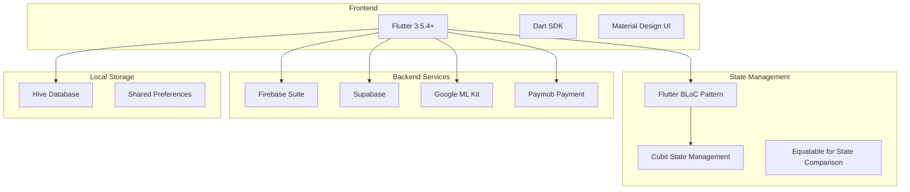
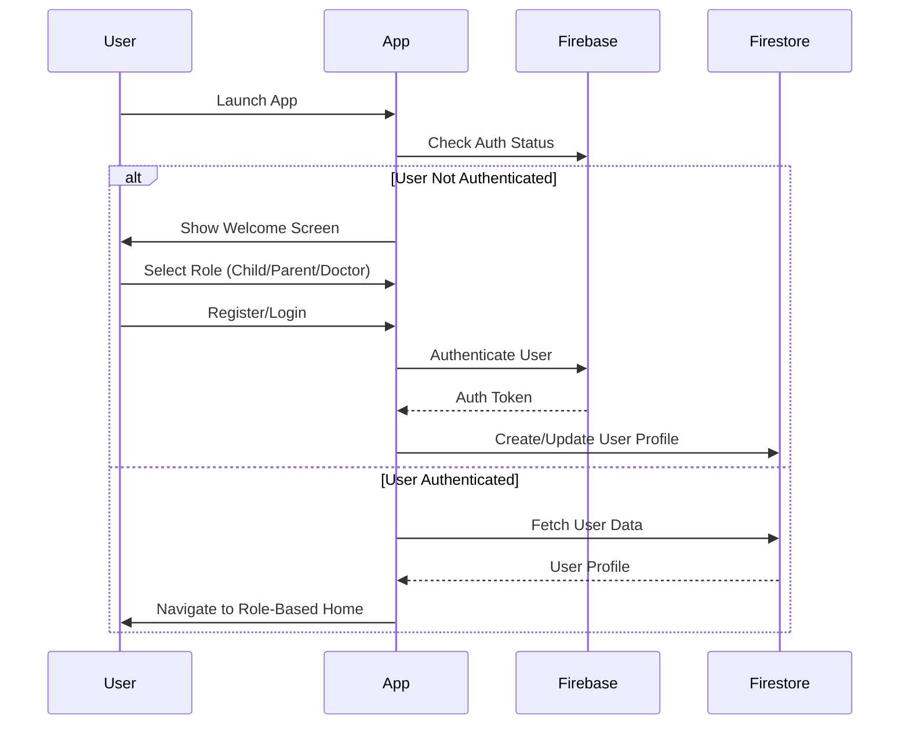
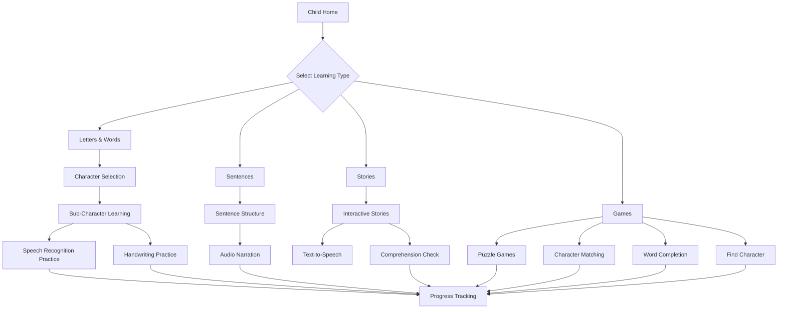
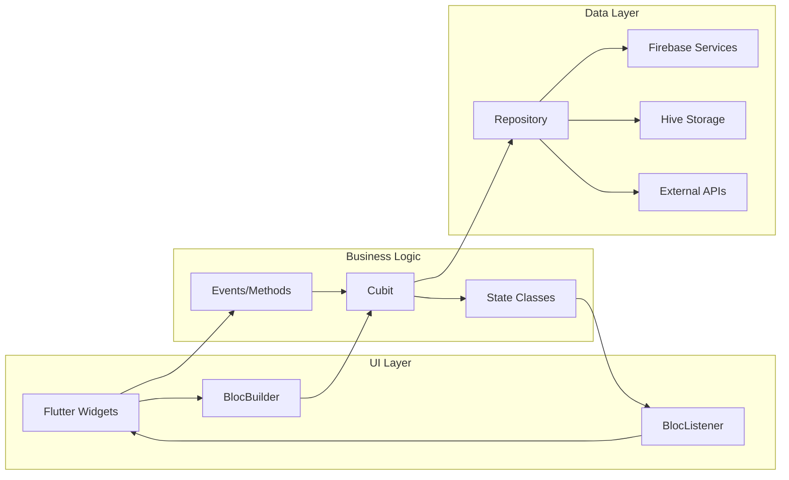
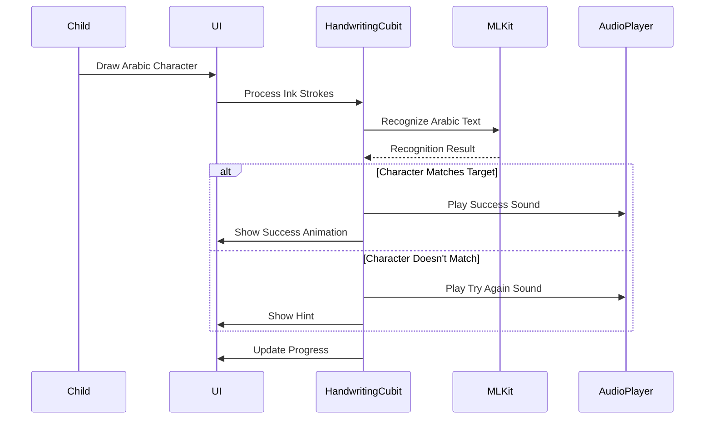
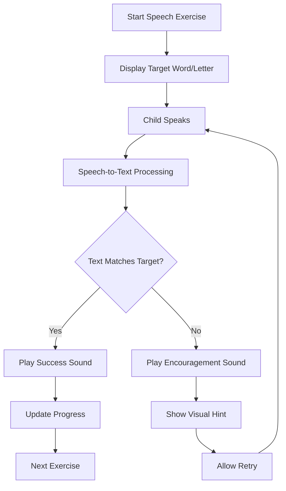
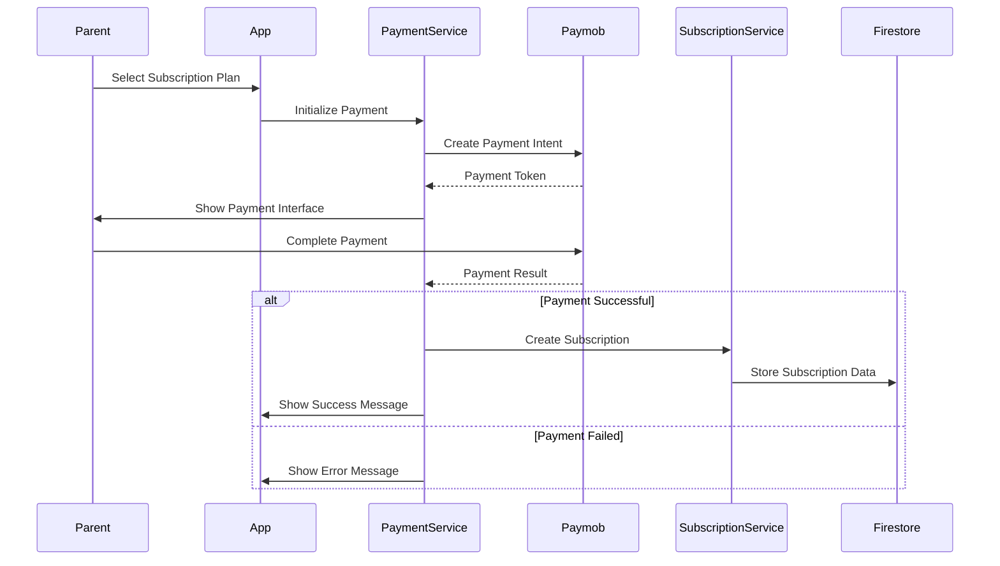
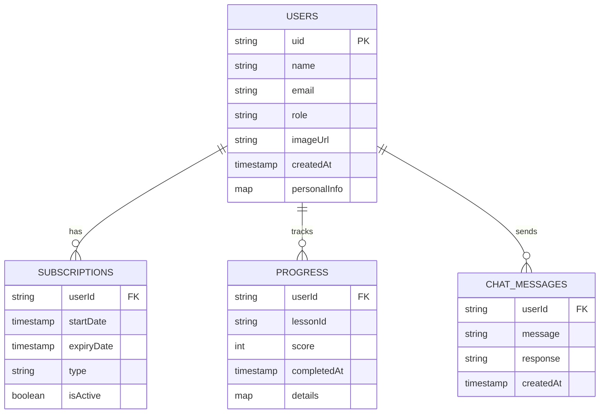

# Yosrixia - Arabic Learning App for Dyslexic Children

Yosrixia is a comprehensive Flutter-based educational application designed specifically for children with dyslexia to learn Arabic language through interactive lessons, games, and AI-powered features. The app provides a multi-role platform supporting children, parents, and doctors with specialized tools for learning, monitoring, and treatment.

## 🌟 Features

### For Children
- **Interactive Arabic Lessons**: Learn Arabic letters, words, and sentences through engaging tutorials
- **Educational Games**: Multiple game types including puzzles, handwriting recognition, character matching, and word completion
- **Speech Recognition**: AI-powered Arabic speech-to-text for pronunciation practice
- **Handwriting Recognition**: Google ML Kit integration for Arabic handwriting practice
- **Stories & Audio**: Interactive storytelling with audio narration
- **Chat System**: AI-powered chat assistance for learning support
- **Progress Tracking**: Visual progress indicators and achievements

### For Parents/Guardians
- **Child Monitoring**: Track child's learning progress and performance
- **Doctor Consultation**: Connect with specialized doctors for dyslexia treatment
- **Subscription Management**: Flexible payment options with Paymob integration
- **Profile Management**: Manage child profiles and learning preferences

### For Doctors
- **Patient Management**: Monitor multiple children's progress
- **Assessment Tools**: Specialized dyslexia assessment questionnaires
- **Treatment Tracking**: Track treatment effectiveness and progress
- **Communication**: Direct communication with parents and children

## 🏗️ Architecture

### Technology Stack



### Project Structure

```
lib/
├── core/                          # Core functionality and shared resources
│   ├── cubit/                     # Global state management
│   ├── database/                  # Firebase services
│   ├── helper/                    # Utility functions and helpers
│   ├── models/                    # Data models
│   ├── services/                  # External service integrations
│   ├── utils/                     # Constants, styles, routing
│   └── widgets/                   # Reusable UI components
├── features/                      # Feature-based modules
│   ├── auth/                      # Authentication system
│   ├── child/                     # Child-specific features
│   │   ├── chat/                  # AI chat system
│   │   ├── dross/                 # Learning lessons
│   │   │   ├── gomal/            # Sentence lessons
│   │   │   ├── stories/          # Interactive stories
│   │   │   └── words/            # Letter and word lessons
│   │   ├── games/                 # Educational games
│   │   │   ├── find_character_game/
│   │   │   ├── handwriting/
│   │   │   ├── identical_character/
│   │   │   └── puzzel/
│   │   ├── profile/               # Child profile management
│   │   └── tips/                  # Learning tips
│   ├── doctor/                    # Doctor dashboard
│   ├── onboarding/                # App onboarding
│   ├── settings/                  # App settings
│   └── subscripton_and_payments/  # Payment system
└── main.dart                      # App entry point
```

## 🔄 Data Flow Architecture

### User Authentication Flow



### Learning Content Flow



### State Management Flow



## 🎮 Game Systems Architecture

### Handwriting Recognition System



### Speech Recognition Flow



## 💳 Payment System Architecture



## 🗄️ Database Schema

### Firebase Firestore Collections



## 🚀 Getting Started

### Prerequisites

- Flutter SDK 3.5.4 or higher
- Dart SDK
- Android Studio / VS Code
- Firebase account
- Supabase account
- Paymob merchant account

### Installation

1. **Clone the repository**
   ```bash
   git clone https://github.com/your-repo/yosrixia.git
   cd yosrixia
   ```

2. **Install dependencies**
   ```bash
   flutter pub get
   ```

3. **Configure Firebase**
   - Create a new Firebase project
   - Add your `google-services.json` (Android) and `GoogleService-Info.plist` (iOS)
   - Update `firebase_options.dart` with your configuration

4. **Configure Supabase**
   - Update `supabase_config.dart` with your Supabase URL and anon key

5. **Configure Paymob**
   - Update payment credentials in `payment_services.dart`

6. **Run the app**
   ```bash
   flutter run
   ```

### Build for Production

```bash
# Android
flutter build apk --release
flutter build appbundle --release

# iOS
flutter build ios --release
```

## 📱 Supported Platforms

- ✅ Android (API 21+)
- ✅ iOS (11.0+)
- ✅ Web
- ✅ Windows
- ✅ macOS
- ✅ Linux

## 🔧 Key Dependencies

| Package | Purpose |
|---------|---------|
| `flutter_bloc` | State management |
| `firebase_core` | Firebase integration |
| `cloud_firestore` | Database |
| `firebase_auth` | Authentication |
| `supabase_flutter` | Additional backend services |
| `google_mlkit_digital_ink_recognition` | Handwriting recognition |
| `speech_to_text` | Arabic speech recognition |
| `audioplayers` | Audio playback |
| `flutter_paymob` | Payment processing |
| `go_router` | Navigation |
| `hive` | Local storage |
| `flutter_screenutil` | Responsive design |

## 🧪 Testing

```bash
# Run unit tests
flutter test

# Run integration tests
flutter test integration_test/
```

## 📝 Contributing

1. Fork the repository
2. Create your feature branch (`git checkout -b feature/amazing-feature`)
3. Commit your changes (`git commit -m 'Add some amazing feature'`)
4. Push to the branch (`git push origin feature/amazing-feature`)
5. Open a Pull Request

## 📄 License

This project is licensed under the MIT License - see the [LICENSE](LICENSE) file for details.

## 🤝 Support

For support, email support@yosrixia.com or join our Discord community.

## 🙏 Acknowledgments

- Google ML Kit team for Arabic handwriting recognition
- Flutter team for the amazing framework
- Firebase team for backend services
- All contributors and testers who helped make this app better

---

Made with ❤️ for children with dyslexia to learn Arabic effectively.